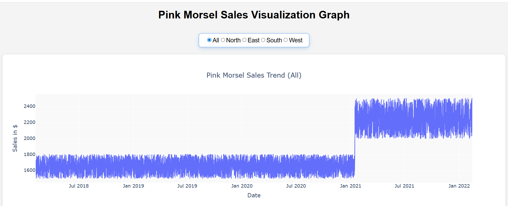

# Pink Morsel Sales Dashboard Project

## 📸 Dashboard Preview

This project is part of the **Quantium Data Analytics Virtual Job Experience Program**.  
It demonstrates your ability to clean data using pandas, build an interactive dashboard through python's dash framework, and implement automated UI tests using Pytest and Bash scripting.

## 📊 Project Overview

The goal of this task was to build a **Dash web application** that visualizes sales performance for the *Pink Morsel* product across different regions.  
The dashboard allows users to:
- View sales trends over time  
- Filter results by region (North, East, South, West, or All)  
- Interact with a responsive Plotly graph  

The project also includes a **test suite** to verify that key UI components are present and functional.

The additional task included **automating test sute** through bash scripting to run the tests of the dash application without manually invoking pytest.

## Features

- **Interactive line chart** of sales over time  
- **Region picker dropdown** to filter the visualization  
- **Responsive layout** built with Dash  
- **Automated tests** using Chrome driver + Pytest 
- **Bonus:** Bash script to run the entire test suite automatically

## 🗂️ Project Structure
- The main directory for the project is quantium-starter-Ibi-repo/
- app.py                 # Main Dash application
- Sales_data.csv         # Cleaned dataset
- requirements.txt       # Project dependencies
- run_tests.sh           # Bash script to run tests (bonus task)
- dashboard.png          # Screenshot of the dashboard
- tests/ │
  └── test_app.py        # Pytest test suite
  

## ▶️ How to Run the App

### 1. Create and activate a virtual environment
python -m venv venv venv\Scripts\activate

### 2. Install dependencies
pip install -r requirements.txt

### 3. Run the Dash app
python app.py

The app will open in your browser at:
http://127.0.0.1:8050/ # Run this in chrome browser

## 🧪 Running the Test Suite

### Option A — Run tests manually
pytest

### Option B — Use the automated Bash script (part of bonus task)
./run_tests.sh

This script:
- Activates the virtual environment  
- Runs the test suite  
- Returns exit code **0** if all tests pass  
- Returns exit code **1** if any test fails  

## ✔️ Tests Included

The test suite verifies that:

1. **The header of the graph is present**  
2. **The sales visualization graph is present**  
3. **The region picker radio button is present**  

These tests ensure the core UI components load correctly.

## 📦 Dependencies

Key packages used:

- Dash  
- Pandas  
- Plotly  
- Pytest  

Full list available in requirements.txt.

## 🏁 Final Notes

This project demonstrates practical skills in:

- Data visualization  
- Web app development  
- Automated UI testing  
- Clean project structure  
- Reproducible environments  

It is fully ready for submission and suitable for showcasing in a portfolio or to be published in LinkedIn.
